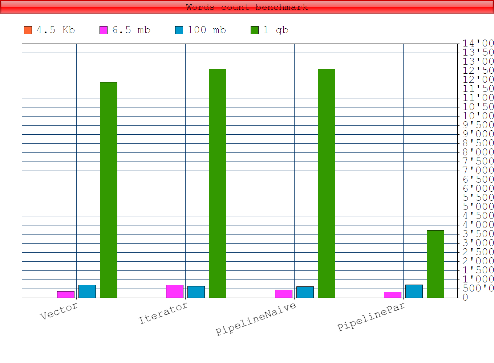

# Results: word count

 |File size | Implementation | Mode | Count | Score | Error | Units |
|-----------|-----------|------|-------|-------|-------|------ |
|4.5 Kb
| | Vector |           avgt |  200  |    242,126 | ± 4,480 | us/op|
|  | Iterator    |    avgt  | 200   |  265,141  | ±    16,806  | us/op |
| | DataPipeline (naive implementation)   |avgt  |200     |279,495 |±    13,810  | us/op |
| | DataPipeline (parallel with combineByKey)| avgt | 200  |  1274,492 |±    71,240  |us/op|
| |
| 6.5 mb|
| | DataPipeline (parallel with combineByKey)| avgt  |200  |320722,195 |±  7002,904  |us/op|
| | Vector       |   avgt  |200  |354740,033 |± 11436,666  |us/op|
| | DataPipeline (naive implementation)   |   avgt | 200 | 436694,191 |± 14781,783 | us/op|
| | Iterator    | avgt | 200  |691346,871| ±  3800,458|  us/op|
| |
| 100 mb |
| | DataPipeline (naive implementation)  | avgt   |30     |628,141| ±   25,369 | ms/op|
| | Iterator   |   avgt  | 30   |  641,539| ±   34,984  |ms/op
| | Vector       |    avgt |  30  |   708,016 | ±   82,627  | ms/op
| | DataPipeline (parallel with combineByKey)|  avgt  | 30   |  726,254 |±   53,225 | ms/op|
| |
| 1 Gb |
| | DataPipeline (parallel with combineByKey) | avgt | 20 | 3711 | | ms/op |
| | Iterator | avgt | 20 | 11823 | | ms/op
| | Vector | avgt | 20 | 11889 | | ms/op
| | DataPipeline (naive) | avgt | 20 | 12332 | | ms/op |
## Visualisation

## Notes
- See [JMH benchmark](src/main/scala/trembita/KernelWordsCountBench.scala) for files <= 100 mb
- See [here](src/main/scala/trembita/OhMyGoodnessBench.scala) for 1 Gb file bench
- See [words count algorithms](src/main/scala/trembita/WordsCountFiles.scala)
- Check [algorithms validity](src/main/scala/trembita/Test.scala)
